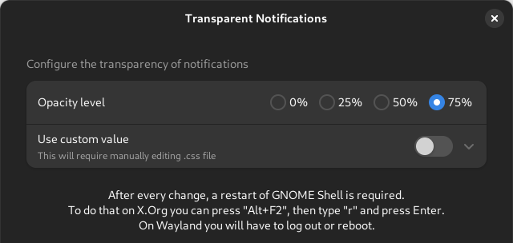

# gnome-shell-extension-transparent-notifications

Compatible with modern version of GNOME Shell, notification background was changed to match the default theme, there is now an extension settings menu for choosing levels of transparency.

# Compatibility notice

The release for GNOME 45 is not backward compatible with older versions of the shell.

# Installation

1. Download the latest release
2. `cd` to the download directory
3. `gnome-extensions install transparent-notifications@eleweth.zip`
4. Log out and log back in, or reboot
5. `gnome-extensions enable transparent-notifications@eleweth`
6. \[optional\] Configure the extension: `gnome-extensions prefs transparent-notifications@eleweth`

On X.Org, instead of step 3 you can restart the GNOME Shell by pressing Alt+F2, typing "r" and pressing ENTER. Save and close all important files and programs before doing that. 
